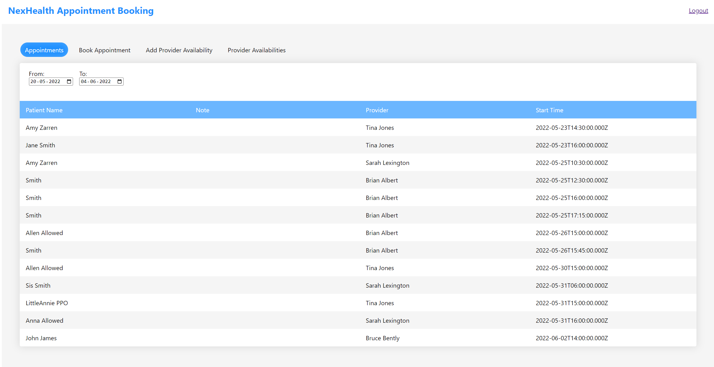

<h1>NexHealth QuickStart</h1>



- [Getting started](#getting-started)
- [Prerequisites](#prerequisites)
- [Clone the repository](#clone-the-repository)
- [Configuration](#configuration)
- [Installation](#installation)
- [Starting the Node server and Frontend app](#starting-the-node-server-and-frontend-app)

## Getting started

This repository was created to assist you in getting started with the [NexHealth API](https://docs.nexhealth.com/reference/introduction).
Using this repository, you can rapidly create a [Node](https://nodejs.org/en/) server that interacts with the NexHealth API for appointment scheduling and provider management.

You can book appointments, view them, and manage the providers using the frontend app built with [React](https://facebook.github.io/react/).

## Prerequisites

Please ensure that you have the most recent version of [Node](https://nodejs.org/en/) installed. You can download the latest version of Node [here](https://nodejs.org/en/download/).

## Clone the repository

Using https:

```sh
git clone https://github.com/prabhuignoto/NexHealth
cd NexHealth
```

Alternatively, if you use ssh:

```sh
git clone git@github.com:prabhuignoto/NexHealth.git
cd NexHealth
```

## Configuration

Please ensure that you have permission to use the [NexHealth API](https://docs.nexhealth.com/reference/introduction). Please fill out this [form](https://www.nexhealth.com/api-request/request-access) to request access.

Once you have access, populate the `.env` file under the `server` folder with the appropriate values. Please use the sample `.env.example` located under the server folder as a template.

> Both the front end and the back end apps comes with a sample `.env` file. Please make sure to update the values with your own.

Here are the mandatory env values you need to successfully start the Node server:

| Properties  | description                                                     |
| :---------- | :-------------------------------------------------------------- |
| API_URL     | This will be the sandbox url e.g: https://sandbox.nexhealth.com |
| SUBDOMAIN   | Refers to a specific Institution                                |
| LOCATION_ID | Refers to a specific location                                   |
| API_KEY     | API Key provided by NexHealth                                   |

Also, check the following lines in server/server-config.js to make sure the node server is using the right .env file:

```js
  config({
    path: `${__dirname}/.env.example`,
  });
```

The above line will load the `.env.sample` file from the server folder.

Similarly, in the `.env` file under the `frontend` folder, change the 'location id' to the one assigned for you.

Here is how the frontend app's `.env` file looks:

```sh
REACT_APP_API=http://localhost:4000/api
REACT_APP_LOCATION_ID=<location_id>
```

> Note: `.env` files are convenient for local development. Do not run production applications using .env files.

Please contact the NexHealth team if you have any questions about these values.

## Installation

Install the required dependencies using the following command:

```sh

cd ./server
npm install

cd ./frontend
npm install

```

## Starting the Node server and Frontend app

Navigate to the server folder and run the following command:

```sh
cd ./server
npm run start
```

If everything is working, you should see the following message:

```sh
[nodemon] reading config .\nodemon.json
[nodemon] to restart at any time, enter `rs`
[nodemon] or send SIGHUP to 14688 to restart
[nodemon] ignoring: .git node_modules/**/node_modules
[nodemon] watching path(s): *.js routers\*.js
[nodemon] watching extensions: js,json
[nodemon] starting `node --harmony index.js`
[nodemon] spawning
[nodemon] child pid: 11036
[nodemon] watching 8 files
Server is running on port 4000
```

To start the frontend app:

```sh
cd ./frontend
npm run start
```

If everything was set up correctly, you should be able to access the UI at the following url: http://localhost:3000/
